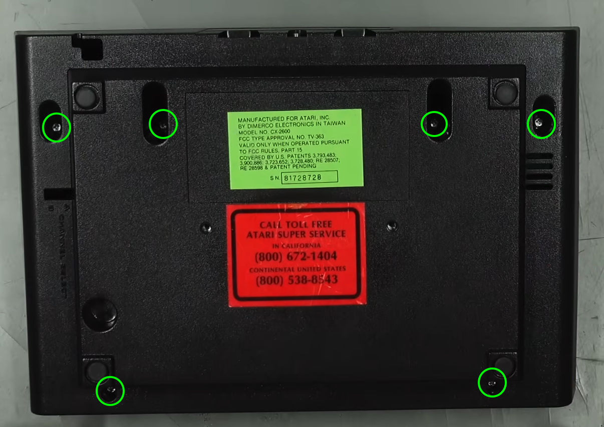
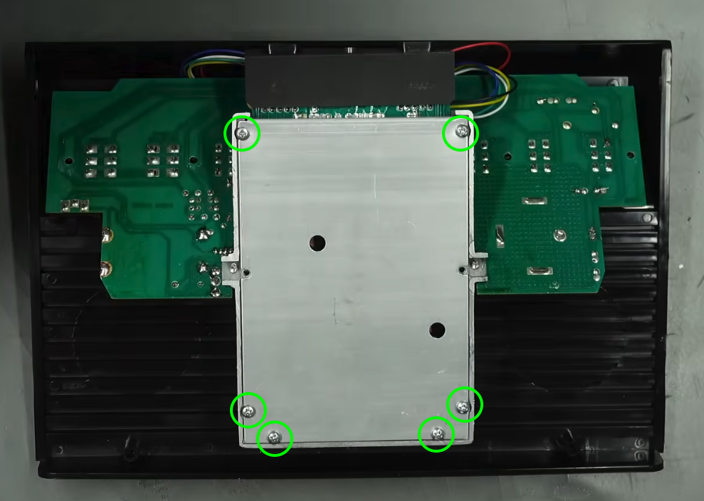
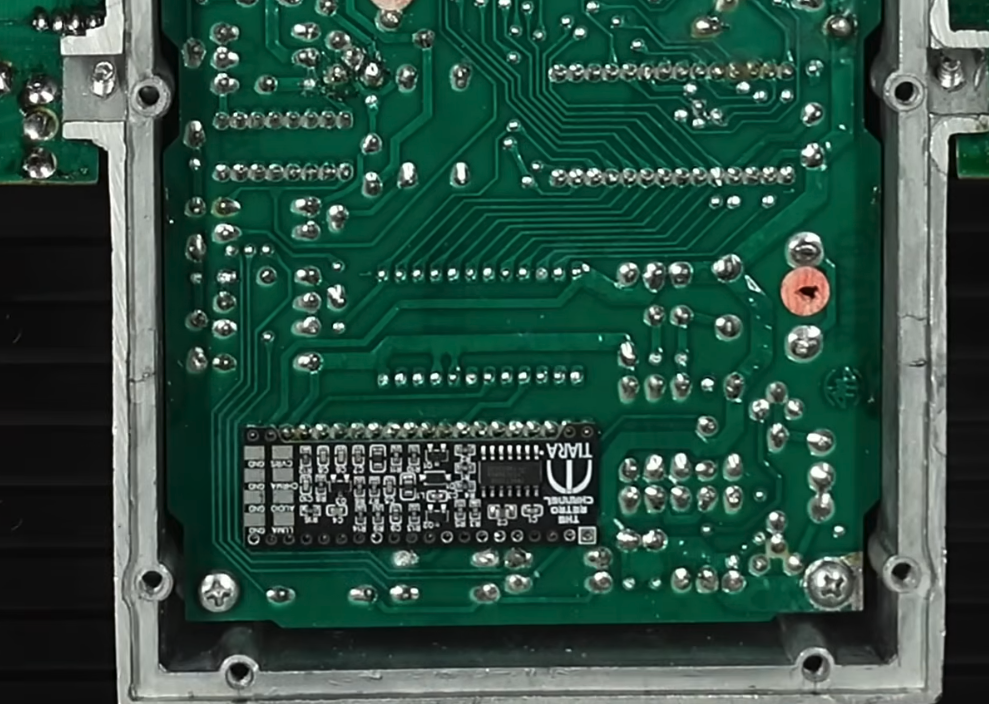
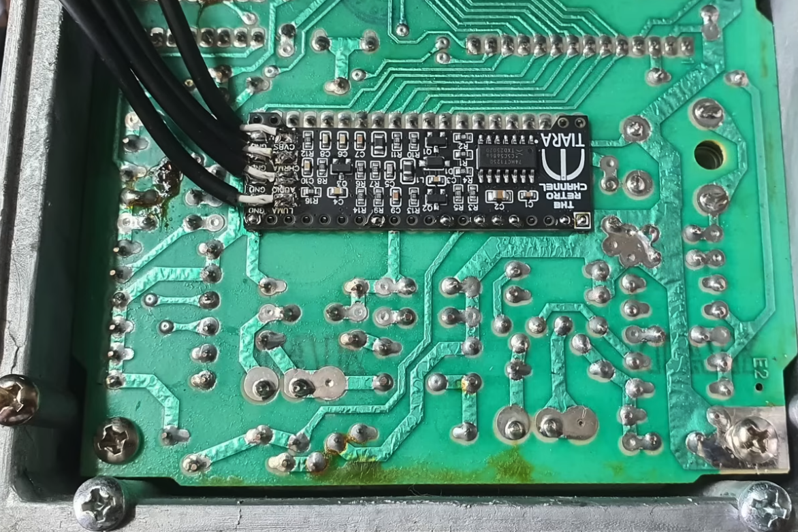
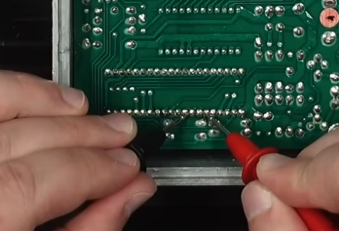
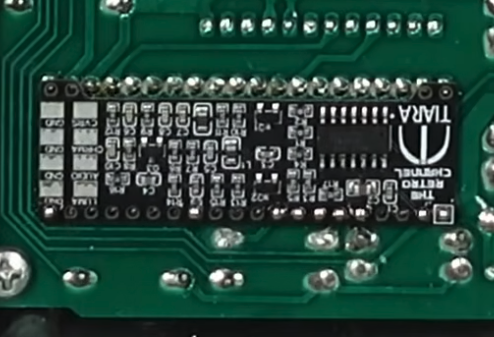

### Things you will need for this modification
- A 6 switcher atari 2600
- The composite mod board [available here](https://lectronz.com/products/tiara-atari-2600-s-video-and-composite-mod)
- A philips screwdriver
- A soldering iron and solder

First off, flip the 2600 over, and unscrew the 6 screws holding the case in place, and then lift off the bottom cover.

Then, unscrew the 6 screws on the metal box housing the PCB.

Locate the area you will be putting the mod board, will be around here for the NTSC version.

and around here for the PAL version.

Check pins 6 and 9 with a multimeter to see if theres any resistance, if there is you will need to remove the resistor there.

Make sure your board is lined up properly, then flow solder into the pins that have a plated through-hole.

You will now have installed the mod board! Now we have to add a connector to it.
We will be using the
